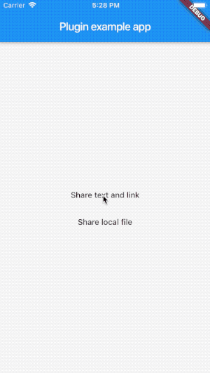

# Share Plugin

[](https://pub.dartlang.org/packages/flutter_share)

## ** This plugin was discontinued after the [flutter official one](https://pub.dev/packages/share) add support to files **

A Flutter plugin for IOS and Android providing a simple way to share a message, link or local files.

## Features:

* Share messages and/or link urls.
* Share local files.

 &nbsp; &nbsp; &nbsp;
&nbsp; 

## Installation

First, add `flutter_share` as
a [dependency in your pubspec.yaml file](https://flutter.io/using-packages/).

### iOS

Add if not exists one row to the `ios/podfile` after target runner:

```
...

target 'Runner' do
    use_frameworks!

...
```

### Android

If you pretends to use the file share, you need to configure the file provider, this will give
access to the files turning possible to share with other applications.

Add to `AndroidManifest.xml`:

```
<application>
...
<provider
    android:name="androidx.core.content.FileProvider"
    android:authorities="${applicationId}.provider"
    android:exported="false"
    android:grantUriPermissions="true">
    <meta-data
        android:name="android.support.FILE_PROVIDER_PATHS"
        android:resource="@xml/provider_paths"/>
</provider>
</application>
```

Obs: You can change the android:name if you have an extension of file provider.

Add `res/xml/provider_paths.xml`:

```
<?xml version="1.0" encoding="utf-8"?>
<paths xmlns:android="http://schemas.android.com/apk/res/android">
    <external-path name="external_files" path="."/>
</paths>
```

If you want to learn more about file provider you can access:

- https://developer.android.com/reference/android/support/v4/content/FileProvider

### Example

Here is an example flutter app displaying the two shares methods. (I'm using documents_picker just
to get a local file you don't need to use.)

```dart
import 'package:flutter/material.dart';
import 'dart:async';

import 'package:flutter/services.dart';
import 'package:flutter_share/flutter_share.dart';
import 'package:documents_picker/documents_picker.dart';

void main() => runApp(MyApp());

class MyApp extends StatelessWidget {
  Future<void> share() async {
    await FlutterShare.share(
      title: 'Example share',
      text: 'Example share text',
      linkUrl: 'https://flutter.dev/',
      chooserTitle: 'Example Chooser Title'
    );
  }

  Future<void> shareFile() async {
    List<dynamic> docs = await DocumentsPicker.pickDocuments;
    if (docs == null || docs.isEmpty) return null;

    await FlutterShare.shareFile(
      title: 'Example share',
      text: 'Example share text',
      filePath: docs[0] as String,
    );
  }

  @override
  Widget build(BuildContext context) {
    return MaterialApp(
      home: Scaffold(
        appBar: AppBar(
          title: const Text('Plugin example app'),
        ),
        body: Center(
          child: Column(
            crossAxisAlignment: CrossAxisAlignment.center,
            mainAxisAlignment: MainAxisAlignment.center,
            children: <Widget>[
              FlatButton(
                child: Text('Share text and link'),
                onPressed: share,
              ),
              FlatButton(
                child: Text('Share local file'),
                onPressed: shareFile,
              ),
            ],
          ),
        ),
      ),
    );
  }
}
```

[Feedback welcome](https://github.com/lubritto/flutter_share/issues) and
[Pull Requests](https://github.com/lubritto/flutter_share/pulls) are most welcome!
